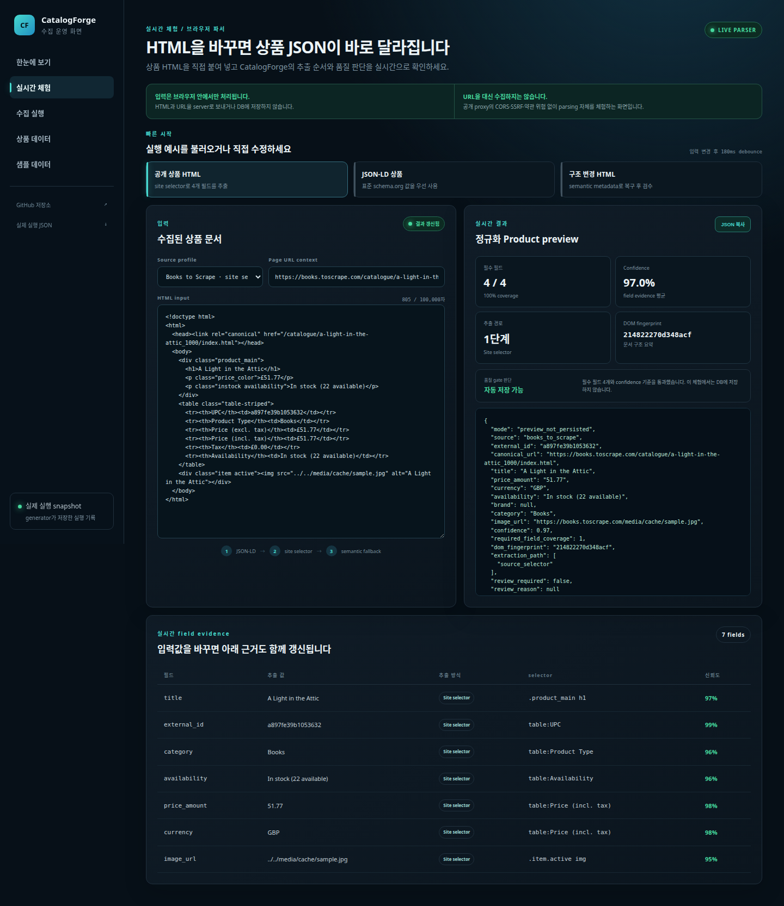
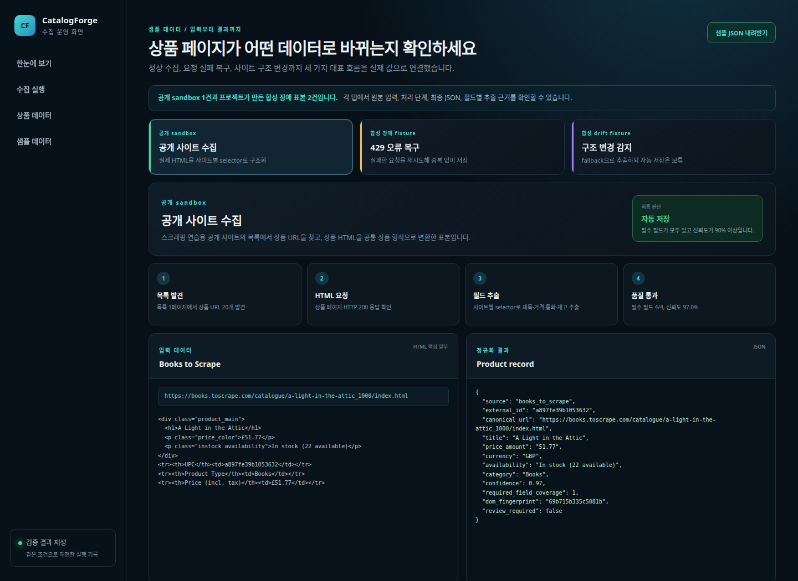
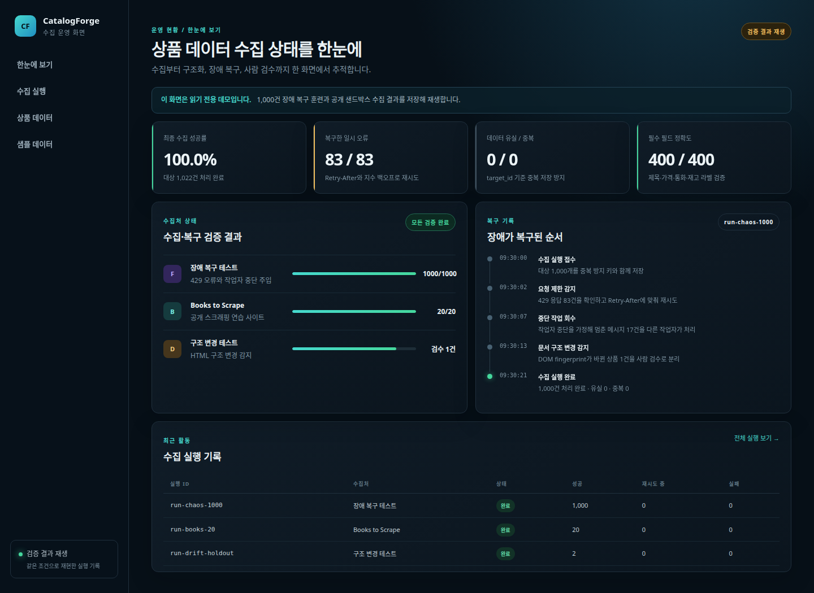

# CatalogForge

**[실시간 파싱 체험](https://zodia8393.github.io/catalog-forge/playground/)** · [운영 화면](https://zodia8393.github.io/catalog-forge/) · [실제 실행 JSON](https://zodia8393.github.io/catalog-forge/sample-products.json) · [시스템 설계](docs/system_design.md)

여러 쇼핑몰의 상품 페이지를 동시에 수집하고, 서로 다른 문서 구조를 하나의 상품 형식으로 바꾸는 **웹 데이터 수집·운영 시스템**입니다. 일시적인 요청 실패, 작업자 중단, 사이트 구조 변경이 발생해도 데이터가 유실되거나 잘못 저장되지 않도록 설계했습니다.

> 공개 데모의 **실시간 체험**은 입력 HTML을 browser 안에서 즉시 파싱하며, 운영 화면은 **실제 pipeline을 실행해 생성한 읽기 전용 snapshot**입니다. URL proxy나 공개 쓰기 API는 노출하지 않습니다.

## 30초 요약

~~~text
상품 URL 등록
    ↓
안전하게 요청 · 실패 시 재시도
    ↓
제목·가격·통화·재고를 공통 형식으로 변환
    ↓
구조 변경과 낮은 신뢰도를 감지
    ↓
정상 데이터는 저장 · 의심 데이터는 사람 검수로 분리
~~~

CatalogForge의 핵심은 “많이 긁는 크롤러”가 아니라 **실패를 복구하고, 데이터 품질을 설명하며, 외부 변화에 안전하게 대응하는 수집 파이프라인**입니다.

## 지원 검토자를 위한 90초 동선

1. [실시간 체험](https://zodia8393.github.io/catalog-forge/playground/)에서 HTML의 상품명·가격을 바꾸고 JSON과 confidence가 즉시 갱신되는지 확인합니다.
2. [한눈에 보기](https://zodia8393.github.io/catalog-forge/)에서 1,022건 성공, 429 복구, 유실·중복 결과를 확인합니다.
3. [샘플 데이터](https://zodia8393.github.io/catalog-forge/samples/)에서 공개 수집·retry·schema drift의 실제 attempt 근거를 확인합니다.

## 검증된 결과

2026-08-27 KST에 고정된 재현 환경과 공개 스크래핑 샌드박스로 확인했습니다.

| 검증 항목 | 결과 | 의미와 근거 |
|---|---:|---|
| 장애 복구 훈련 | 1,000 / 1,000 성공 | [일시 오류 83건을 포함한 총 1,083회 요청](docs/evidence/recovery_rehearsal.json) |
| 작업자 중단 복구 | 17 / 17 회수 | [처리 중 멈춘 메시지를 다른 작업자가 이어서 처리](docs/evidence/recovery_rehearsal.json) |
| 데이터 무결성 | 유실 0 · 중복 0 | [<code>target_id</code> 기준 멱등 저장](docs/evidence/recovery_rehearsal.json) |
| 필수 필드 파싱 | 400 / 400 정확 | [상품 100개 × 제목·가격·통화·재고 4개 필드](tests/test_parser.py) |
| 공개 사이트 연결 | 20 / 20 성공 | [Books to Scrape 목록 1페이지에서 상품 20개 수집](docs/evidence/books_to_scrape_demo.json) |
| 데모 snapshot | 1,022 / 1,022 성공 | [외부 수집 + 장애 복구 + 구조 변경 감지를 실제 실행한 원본 JSON](web/public/sample-products.json) |
| 비동기 처리량 | 단일 처리 대비 28.76배 | [10ms 지연을 고정한 1,000페이지 통제 실험](docs/evidence/benchmark.json) |
| 자동 회귀 검증 | 테스트 20개 통과 | 설정, 파서, 구조 변경, API, SSRF, redirect, 재시도, 복구 |
| Frontend 보안 점검 | 취약점 0개 | Next.js 16.3.3 기준 <code>npm audit</code> |

처리량 수치는 실제 쇼핑몰 성능을 과장하지 않도록 네트워크 지연을 10ms로 고정한 비교 실험입니다. 실제 수집 속도는 대상 사이트의 응답 시간과 요청 정책에 따라 달라집니다.

## 라이브 데모에서 볼 수 있는 것

- **[실시간 체험](https://zodia8393.github.io/catalog-forge/playground/):** 문서 입력 → 필드 추출 → 품질 검사 → 결과 분기를 한 화면에서 확인
- **한눈에 보기:** 실제 run 3개의 성공률, 복구한 429, 유실·중복, 선택한 상품의 필수 필드
- **수집 실행:** 실제 UUID와 생성 시각, 상태별 건수, 장애 복구 순서
- **상품 데이터:** DB에 저장된 실제 product UUID, 값, 신뢰도, 문서 구조 지문, 검수 여부
- **[샘플 데이터](https://zodia8393.github.io/catalog-forge/samples/):** 실제 HTML·attempt → 처리 단계 → 저장 JSON → 필드 근거와 응답 SHA-256

## 실제 입출력 샘플

공개 스크래핑 sandbox에 실제 요청해 가져온 상품 1건은 다음과 같이 공통 상품 형식으로 바뀝니다. 429 오류 복구와 문서 구조 변경도 로컬 ASGI fixture에 실제 요청해 검증했습니다. run·attempt·product·review 전체 기록은 [실제 실행 JSON](web/public/sample-products.json)으로 내려받을 수 있습니다.

[실시간 체험](https://zodia8393.github.io/catalog-forge/playground/)에서는 아래 HTML을 직접 편집할 수 있습니다. 입력할 때마다 JSON, 필수 필드 coverage, confidence, DOM fingerprint, field evidence와 품질 gate 판단을 같은 화면에서 다시 계산합니다.

~~~text
입력 HTML
<h1>A Light in the Attic</h1>
<td>£51.77</td>
<td>In stock (22 available)</td>

             ↓ site selector + quality gate

출력 JSON
{
  "source": "books_to_scrape",
  "external_id": "a897fe39b1053632",
  "title": "A Light in the Attic",
  "price_amount": "51.77",
  "currency": "GBP",
  "availability": "In stock (22 available)",
  "confidence": 0.97,
  "review_required": false
}
~~~

## 핵심 설계

| 문제 | 구현한 해결책 |
|---|---|
| API 저장 직후 메시지가 사라질 수 있음 | PostgreSQL의 대상 데이터와 transactional outbox를 한 transaction에 저장 |
| 작업자가 처리 중 멈출 수 있음 | Redis Streams consumer group과 stale message 회수 |
| 일시적인 429·5xx가 발생함 | <code>Retry-After</code>, exponential backoff, circuit breaker |
| 사이트마다 HTML 구조가 다름 | JSON-LD → 사이트별 selector → semantic metadata 순서로 파싱 |
| 사이트 구조 변경이 잘못된 데이터로 이어짐 | DOM fingerprint와 필드 coverage·confidence를 함께 검사해 검수 대기열로 격리 |
| 위험하거나 과도한 요청이 발생할 수 있음 | host allowlist, robots.txt, SSRF·redirect 방어, 응답 크기·동시성·속도 제한 |
| JavaScript로 렌더링되는 페이지가 있음 | 허용된 host에만 Playwright Chromium fallback 적용 |

~~~text
Next.js 운영 화면
        ↓
FastAPI ──→ PostgreSQL + transactional outbox
                              ↓
                        Redis Streams
                              ↓
               비동기 worker · 중단 작업 회수
                              ↓
                 httpx · Playwright fallback
                              ↓
                parser · 구조 변경 검수 gate
                              ↓
                         상품 catalog
~~~

상세 내용은 [시스템 설계](docs/system_design.md), [상품 데이터 계약](docs/data_contract.md), [채용 공고와의 연결](docs/hiring_market_alignment.md), [재현 방법](docs/reproducibility.md)에서 확인할 수 있습니다.

## Web Scraping 실무와 연결되는 부분

| 채용 공고의 업무 | CatalogForge에서 구현한 경험 |
|---|---|
| 다양한 온라인 소스의 안정적인 수집·처리 | connector별 파싱, 공개 sandbox 수집, 브라우저 fallback |
| 대규모 동시 요청과 실패 복구 | 비동기 동시성 제어, retry, circuit breaker, stale reclaim, 멱등 저장 |
| 서로 다른 웹 문서의 구조화 | JSON-LD·selector·semantic metadata를 단계적으로 적용 |
| 안정적인 데이터 파이프라인 | PostgreSQL outbox → Redis Streams → worker → 품질 gate |
| 외부 구조 변경 대응 | DOM fingerprint 변화와 필드 품질 저하를 함께 감지해 자동 저장을 보류 |

## 5분 실행

~~~bash
cp .env.example .env
docker compose up --build
~~~

- 운영 화면: <code>http://localhost:3000</code>
- API 문서: <code>http://localhost:8100/docs</code>
- 재현용 상품 사이트: <code>http://localhost:8101/catalog</code>

재현용 상품 1개를 수집하려면 다음 요청을 실행합니다.

~~~bash
curl -X POST http://localhost:8100/api/v1/crawl-runs \
  -H 'Content-Type: application/json' \
  -H 'X-API-Key: local-demo-key' \
  -d '{"connector":"generic","start_urls":["http://fixture:8101/products/1"],"max_pages":1,"render_mode":"http"}'
~~~

## 직접 검증

~~~bash
pip install -e ".[dev]"
PYTHONPATH=src python3 -m pytest -q
PYTHONPATH=src python3 -m catalog_forge.rehearsal --targets 1000 --output-root /tmp/catalog-forge
PYTHONPATH=src python3 -m catalog_forge.recorded_demo --public-products 20 --recovery-targets 1000 --output web/public/sample-products.json

cd web
npm ci
npm audit --audit-level=high
npm run typecheck
npm run build
~~~

공개 사이트 연결은 대상이 스크래핑 연습용 샌드박스임을 확인한 뒤 별도로 실행합니다.

~~~bash
PYTHONPATH=src python3 -m catalog_forge.public_demo --products 20 --output-root /tmp/catalog-forge
~~~

`recorded_demo` 명령은 다음 세 run을 순서대로 실제 실행하고 하나의 snapshot을 만듭니다.

1. 로컬 ASGI fixture 상품 1,000개 처리: 429 83건 재시도, 중단 message 17건 회수
2. allowlist에 등록된 Books to Scrape 상품 20개 실제 HTTP 수집
3. baseline HTML 다음에 변경 HTML을 처리해 `schema_drift` review 1건 생성

생성 파일에는 실제 UUID·UTC 시각·HTTP 상태·attempt ID·응답 크기와 SHA-256이 포함됩니다. 전체 외부 HTML은 저장하지 않고 화면에 필요한 실제 excerpt만 포함합니다.

## 현재 범위와 한계

- v1은 login, CAPTCHA, proxy rotation, 차단 우회를 지원하지 않습니다.
- LLM 기반 속성 추출은 재현 가능한 파싱·복구 품질을 먼저 증명하기 위해 제외했습니다.
- GitHub Pages 데모는 실제 실행 snapshot을 보여주는 읽기 전용 화면이며 공개 쓰기 API를 노출하지 않습니다.
- 실제 상용 수집처를 추가할 때는 사이트 약관, robots 정책, 요청량 예산을 별도로 검토해야 합니다.
