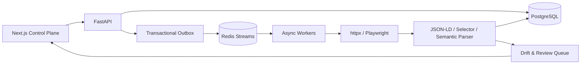

# System Design

## 목표

CatalogForge는 commerce URL을 빠르게 가져오는 것보다 **실패해도 복구되고, 구조가 바뀌면 조용히 오염시키지 않는 수집 시스템**을 목표로 한다.

## 상태와 복구

- PostgreSQL이 crawl run, target, attempt, product snapshot, review의 source of truth다.
- API transaction은 target과 outbox row를 함께 기록한다. Publisher가 outbox를 Redis Streams로 전달하므로 API와 broker 사이의 유실 구간을 줄인다.
- Worker는 Redis consumer group을 사용하고 완료 후에만 ACK한다. 미완료 pending message는 `XAUTOCLAIM`으로 다른 worker가 회수한다.
- 429와 5xx, timeout, transport error만 retry한다. robots disallow, invalid URL, oversized response, parse failure는 무한 재시도하지 않는다.
- 동일 message가 다시 전달되어도 `target_id` unique boundary로 product snapshot을 중복 생성하지 않는다.

## 파싱과 drift

추출 우선순위는 `JSON-LD Product → connector selector → semantic metadata`다. 각 field는 값과 함께 source, confidence, selector를 저장한다. Source별 안정 fingerprint를 보존하고 구조 변경과 confidence/coverage 하락이 동시에 나타나면 `schema_drift` review item을 만든다. Drift 상태에서는 새 fingerprint를 자동 baseline으로 승격하지 않는다.

## 보안·운영 경계

- HTTP/HTTPS만 허용하고 host allowlist와 DNS 결과를 함께 검사한다.
- private address는 기본 차단하며 Compose fixture만 별도 private-host allowlist로 허용한다.
- robots.txt, response-size limit, host별 concurrency와 request interval을 적용한다.
- Crawl 생성과 review 변경 API는 `X-API-Key`가 필요하고 credential 값은 log·artifact에 기록하지 않는다.
- CAPTCHA, login, proxy rotation, 차단 우회는 지원하지 않는다.
